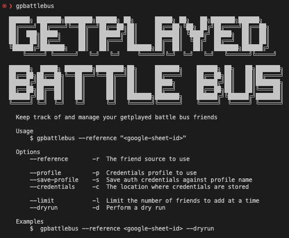

# gpbattlebus - GetPlayed Battle Bus

The aim of this tool is to make it easy for anyone to squad up with other Geptplayed listeners by making it easy to add them as friend.

### Overview



### Pre-requisites

- An EpicGames Account [\[Sign-up\]](https://www.epicgames.com/id/register)
- An environment to install and run the tool ( Tested against Node.js v18+ )

### Installation

The following assumes you have access to an environment with Node.js available.

```
$ npx github:indieisaconcept/gpbattlebus
```

#### Example Usage

Note you will need to supply the flag `--reference`. The value for this can be found in the getplayed discord.

`$ npx github:indieisaconcept/gpbattlebus --profile <username>`

1. Login using supplied found credentials
2. Fetch friends list from Google Sheet
3. Add missing friends

`$ npx github:indieisaconcept/gpbattlebus --profile <username> --dryrun`

1. Login using supplied found credentials
2. Fetch friends list from Google Sheet
3. Display summary of current friendships

#### Authentication

The tool makes use of the library [Fnbr.js](https://fnbr.js.org/) to interact with the Epic API. Authentication with your Epic account is achieved by generating an authentication token against a known [Epic Client](https://github.com/fnbrjs/fnbr.js/blob/main/resources/AuthClients.ts) which supports device authentication.

This token can only be generated when you are logged in and only you have access to it.

Credentials are saved to `./authDevice.json` and scoped based on the supplied profile name. You will be asked to supply an "authorizationCode" if there is no valid profile.

```
{
  "gp.battle.bus": {
    "accountId": "********************************",
    "deviceId": "********************************",
    "secret": "********************************"
  },
  "indieisaconcept": {
    "accountId": "********************************",
    "deviceId": "********************************",
    "secret": "********************************"
  }
}
```

> An example credentials file

The location of your credentials file can be overriden by suppling a value for `--credentials`.

### Contributing

In lieu of a formal styleguide, take care to maintain the existing coding style. Add unit tests for any new or changed functionality. Lint and test your code using npm test

### Roadmap

#### Test, tests, tests 😳

#### Improve friend adding accuracy

You'll notice that there is an account on the spreadsheet named "gp.battle.bus". I created this account with the intention that a listener would first add this account as a friend and then run the tool. The "gp.battle.bus" user could then become the authoritive source for friends.

In the future I plan to add support via a flag to use this users friend list instead of the spreadsheet.

### Release History

- 1.0.0 Initial release

Hey ... you just got played 🪣
