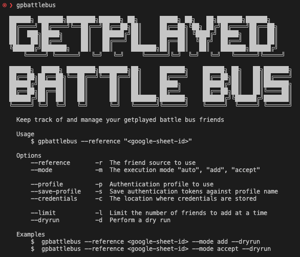

# gpbattlebus - GetPlayed Battle Bus

The aim of this tool is to make it easy for anyone to squad up with other Getplayed listeners by making it easy to add them as friend.

### Overview



### Pre-requisites

- An EpicGames Account [\[Sign-up\]](https://www.epicgames.com/id/register)
- An environment to install and run the tool ( Tested against Node.js v18+ )

### Local Installation

The following assumes you have access to an environment with Node.js available.

```
$ npx github:indieisaconcept/gpbattlebus
```

### Running via replit

`gpbattlebus` is also available on https://replit.com. As this is a public environment using and saving profiles is disabled. Instead each time you must provide an `authenticationCode`.

When running in the environment you will see the following message.

`# PUBLIC ENVIRONMENT DETECTED PROFILE USE IS DISABLED`

- https://replit.com/@indieisaconcept/gpbattlebus

### Example Usage

Note you will need to supply the flag `--reference`. The value for this can be found in the getplayed discord. The examples below make use of the `--dryrun` flag. When this flag is used no changes will be applied and only a summary is displayed. Remove to apply changes.

There are 3 execution modes which can be specified using the flag `--mode`.

- **add** add prospective friends
- **accept** accept incoming friend requests
- **auto** run both add and accept modes

Examples of these modes can be seen below.

#### Display current friends summary

`$ gpbattlebus --reference <value>`

1. Login using using authorisation code
2. Fetch friends list using reference
3. Display details about current friends

#### Display prospective friends to add

`$ gpbattlebus --profile <username> --reference <value> --mode add --dryrun`

1. Login using the specified profiles credentials
2. Fetch friends list from Google Sheet
3. Display a dryrun summary of friends to be added

#### Display friend requests to accept

`$ gpbattlebus --profile <username> --save-profile --reference <value> --mode accept --dryrun`

1. Login using the specified profiles credentials
2. Save credentials against profile name
3. Fetch friends list from Google Sheet
4. Display summary of incoming friend requests

#### Display prospective friends to add friend requests to accept

`$ gpbattlebus --profile <username> --reference <value> --mode auto --dryrun`

1. Login using the specified profiles credentials
2. Fetch friends list from Google Sheet
3. Display a dryrun summary of friends to be added and friend requests to accept.

### Authentication

The tool makes use of the library [Fnbr.js](https://fnbr.js.org/) to interact with the Epic API. Authentication with your Epic account is achieved by generating authentication tokens against a known [Epic Client](https://github.com/fnbrjs/fnbr.js/blob/main/resources/AuthClients.ts) which supports device authentication.

This token can only be generated when you are logged in and only you have access to it.

Credentials are saved to `./authDevice.json` and scoped based on the supplied profile name. You will be asked to supply an "authorizationCode" if there is no valid profile.

```
{
  "gp.battle.bus": {
    "accountId": "********************************",
    "deviceId": "********************************",
    "secret": "********************************"
  },
  "indieisaconcept": {
    "accountId": "********************************",
    "deviceId": "********************************",
    "secret": "********************************"
  }
}
```

> An example credentials file

The location of your credentials file can be overridden by supplying a value for `--credentials`.

#### Saving credentials

To save your authentication tokens against a profile ensure that the `--save-profile` flag is specified.

`$ gpbattlebus --profile <username> --save-profile`

Note credential saving is only available when running locally and not when using replit.

### Contributing

In lieu of a formal styleguide, take care to maintain the existing coding style. Add unit tests for any new or changed functionality. Lint and test your code using npm test

### Roadmap

#### Test, tests, tests 😳

#### Improve friend adding accuracy

You'll notice that there is an account on the spreadsheet named "gp.battle.bus". I created this account with the intention that a listener would first add this account as a friend and then run the tool. The "gp.battle.bus" user could then become the authoritative source for friends.

In the future I plan to add support via a flag to use this users friend list instead of the spreadsheet.

### Release History

- 1.0.0 Initial release
- 2.0.0 Support running on public hosts
  - Profile persistence is now managed via a flag `--save-profile`
- 2.1.0 Use replit env vars to detect cloud env
  - When replit is detected profile saving is disabled
- 2.2.0 Added mode flag to permit adding, accepting friends independently
- 2.2.1 Added additional external auth sources as fallback for when display name not defined

Hey ... you just got played 🪣
